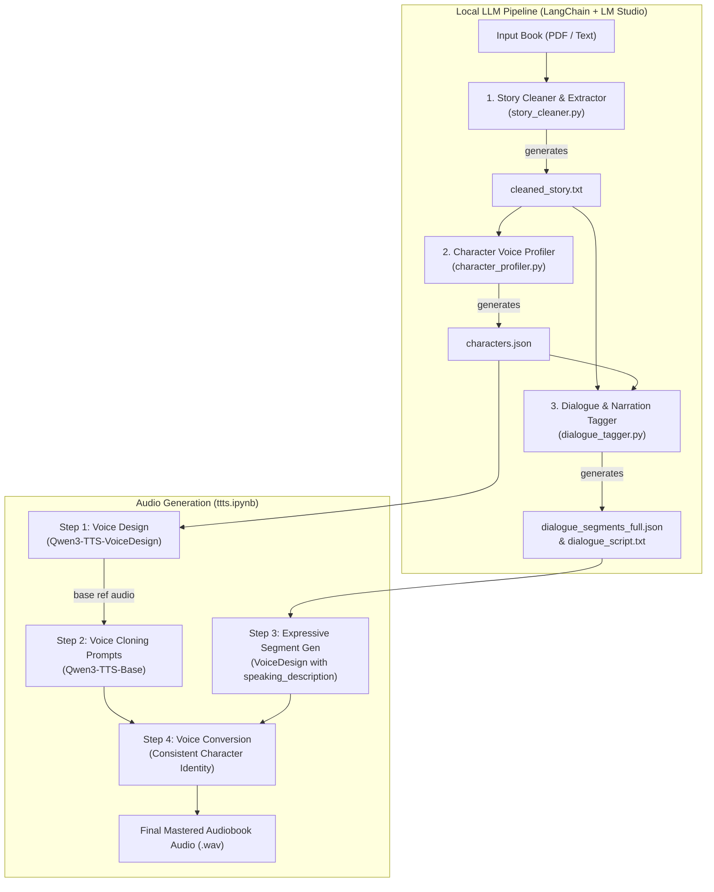

# 🎙️ Expressive Reader

**Expressive Reader** is an end-to-end multi-agent audiobook production pipeline. It transforms raw books and PDFs into expressive, multi-character audiobooks with persistent character voices and nuanced performance delivery.

The preprocessing pipeline runs entirely on **local LLMs via LangChain and LM Studio**—ensuring complete privacy, zero API costs, and low-latency execution—before handing off structured artifacts to the **Qwen3-TTS** voice synthesis engine.

---

## 🏛️ System Architecture



---

## 🚀 Key Features

* **100% Local Inference**: Zero cloud API dependencies for LLM analysis. Connects directly to [LM Studio](https://lmstudio.ai/) running locally at `http://localhost:1234/v1`.
* **Zero-Hallucination Voice Profiling**: Extracts speaking characters, infers baseline voice traits (age category, pitch, pace, tone, speaking style) grounded only in text evidence, and pairs each with an exact reference dialogue line.
* **Context-Aware Dialogue & Narration Tagging**: Accurately differentiates dialogue from narration, resolves speakers, and outputs granular TTS performance delivery instructions (`speaking_description`).
* **Chunking with Overlap**: Processes long novels and multi-chapter books without exceeding LLM context windows or losing cross-sentence context.
* **Seamless TTS Compatibility**: Outputs feed directly into `ttts.ipynb`, which pairs `Qwen3-TTS-VoiceDesign` with `Qwen3-TTS-Base` for expressive emotion transfer and consistent character identity.

---

## 📂 Project Structure

```text
expressive-reader/
├── story_cleaner.py         # Stage 1: Strips TOC, front matter & extracts narrative
├── character_profiler.py    # Stage 2: Extracts character voice profiles & reference quotes
├── dialogue_tagger.py       # Stage 3: Tags dialogue/narration with expressive performance styles
├── pipeline.py              # Unified CLI orchestrator running Stages 1 through 3
├── ttts.ipynb               # Stage 4: Qwen3-TTS audio synthesis & voice cloning notebook
├── requirements.txt         # Python dependencies
├── .gitignore               # Excludes generated audio, models, outputs & virtualenvs
└── README.md                # Project documentation
```

---

## ⚙️ Prerequisites

1. **Python 3.10+**
2. **LM Studio** (or any OpenAI-compatible local LLM server):
   - Start LM Studio and load a model (e.g., `qwen/qwen3-4b`, `nvidia/nemotron-3-nano-4b`, or similar).
   - Start the local server at `http://localhost:1234`.

---

## 📦 Installation

```bash
git clone https://github.com/pes1ug23am221/expressive-reader.git
cd expressive-reader

# Install LLM pipeline dependencies
pip install -r requirements.txt
```

---

## 🛠️ Usage Guide

You can run each stage independently or execute the entire pipeline with a single command.

### Option A: Unified Pipeline Execution

Run all three stages in sequence on a PDF or text file:

```bash
# Process a PDF chapter or book:
python pipeline.py --input chapter1.pdf

# Or run a quick verification test:
python pipeline.py --test
```

---

### Option B: Step-by-Step Execution

#### Stage 1: Story Extractor & Cleaner
Extracts pure story narrative, stripping metadata, table of contents, forewords, and reviews.
```bash
python story_cleaner.py --input chapter1.pdf --output cleaned_story.txt
```
* **Output:** `cleaned_story.txt`

#### Stage 2: Character Voice Profiler
Identifies speaking characters and generates voice descriptions + dialogue reference lines.
```bash
python character_profiler.py --input cleaned_story.txt --output characters.json
```
* **Output:** `characters.json`

#### Stage 3: Dialogue & Narration Tagger
Segments narrative chronologically, attributes dialogue to identified characters, and adds expressive TTS delivery directives.
```bash
python dialogue_tagger.py --story cleaned_story.txt --characters characters.json --output dialogue_segments_full.json
```
* **Outputs:** `dialogue_segments_full.json` & `dialogue_script.txt`

---

## 📋 Data Schemas

### 1. `characters.json`
```json
{
  "characters": {
    "narrator": {
      "name": "Narrator",
      "description": "Neutral voice, adult, clear and steady tone, medium pace, balanced narration style",
      "ref_text": "The wind whispered through the trees."
    },
    "arjun": {
      "name": "Arjun",
      "description": "Young adult male, firm and determined tone, slightly raspy voice, moderate pace",
      "ref_text": "I have a bad feeling about this."
    }
  },
  "total_characters": 2
}
```

### 2. `dialogue_segments_full.json`
```json
{
  "segments": [
    {
      "index": 1,
      "type": "narration",
      "speaker": "narrator",
      "speaking_description": "Neutral narration with steady pacing and subtle tension building.",
      "text": "Arjun stepped into the dark forest.",
      "chunk": 1
    },
    {
      "index": 2,
      "type": "dialogue",
      "speaker": "arjun",
      "speaking_description": "Fast pace with concerned tone, indicating unease.",
      "text": "I have a bad feeling about this.",
      "chunk": 1
    }
  ],
  "total_segments": 2
}
```

---

## 🎧 Audio Generation via `ttts.ipynb`

Once the preprocessing stages generate `characters.json` and `dialogue_segments_full.json`:

1. Open [`ttts.ipynb`](ttts.ipynb) in Jupyter Notebook or Google Colab (with GPU runtime).
2. Run the cells sequentially:
   - **Base Reference Voices**: Uses `Qwen3-TTS-12Hz-1.7B-VoiceDesign` to synthesize baseline voice prints from `characters.json`.
   - **Persistent Clone Prompts**: Precomputes clone prompts using `Qwen3-TTS-12Hz-1.7B-Base`.
   - **Expressive Segments**: Generates emotional deliveries per segment guided by `speaking_description`.
   - **Voice Conversion**: Maps expressive audio to consistent character voice prints, ensuring consistent voice identity throughout the audiobook.

---

## 📄 License

MIT License. See [LICENSE](LICENSE) for details.
